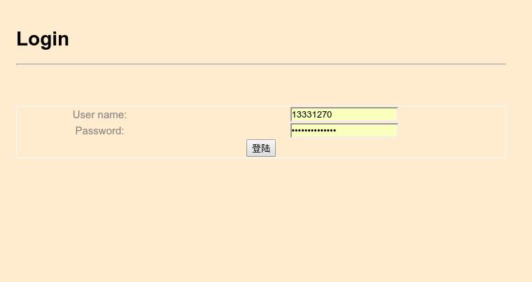
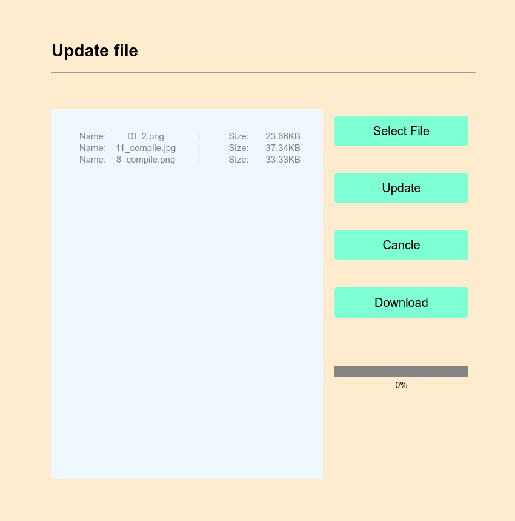
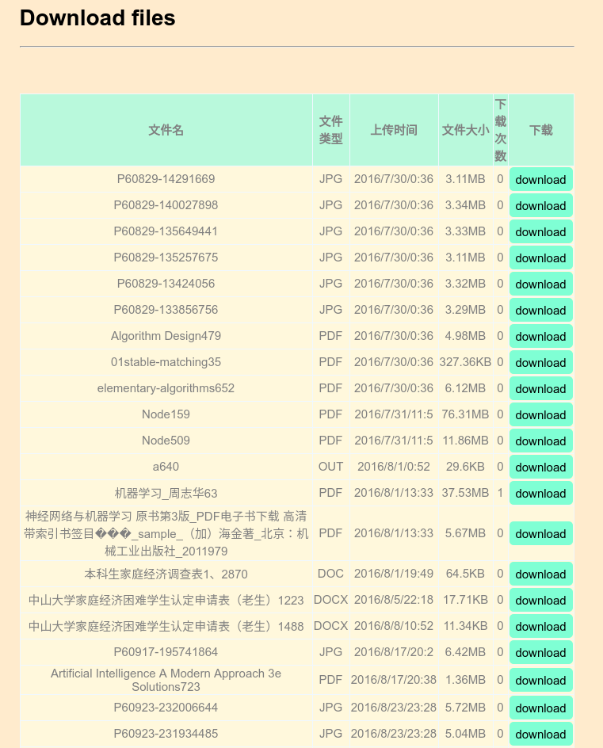

# 多文件上传与下载系统
### 介绍
1. 项目介绍：前端使用jquery框架，服务端使用express框架。这可以说是一个简化版的网盘吧，仅具有上传和下载功能。
2. 功能说明：前端可选择一个或多个文件进行上传，并且前端页面还会实时显示上传的进度。前端还能获得目前上传过的所有文件并且选择下载。
3. 这只是一个个人拿来练习jquery和nodejs的迷你项目，存在有很多bug，且界面方面只是简单的写了下，不是很美观。。。请忽略界面方面，着重在功能实现上吧，不好之处求勿喷～

### 项目运行
1. 需先安装nodejs和mongodb
2. 在项目的跟目录下，运行npm install安装需要的依赖模块。安装完后先启动mongo，然后运行node bin/www，在浏览器中输入lcoalhost:3000即可进入应用

### 技术实现
1. 先说说前端是如何实现多文件上传以及实时更新上传进度的。
首先页面上要有一个`<input type="file" />`，这是用于load本地文件的。注意，该元素有一个change事件，该当我们确定选中的文件时，就会触发该事件，所以我们需要做的就是为该事件注册一个监听函数，该函数中会自带一个`this.files`变量，这是用于存放所选择的文件以及它的一些信息的，例如文件名、文件大小等，于是我们就能利用这些信息做一些自己想做的事了，我自己的做法就是在页面中显示当前已选择的文件，我为其注册的函数为`readFile()`。文件上传功能则是利用jquery的ajax来实现的，上传的数据则是利用`FormData`来保存的。至于上传进度的实现，则是利用了ajax参数里的一个属性：`xhr`以及`XMLHttpRequest`。下面贴上核心代码：
```javascript
    //上传文件, XMLHttpRequest采用ajax形式上传
    function upload(files, callback) {
        if (files.length == 0) {
            return;
        }

        isUpdate = true;
        // 用于保存要上传的文件
        var fd = new FormData();
        // files 保存了要上传的文件组，上传时需要将之放入fd中
        files.forEach(function (file, index) {
            fd.append("file_id_" + index, file);
        });

        $.ajax({
            url: "/update", type: "POST", data: fd, success: afterSend, error: errorSend,
            processData: false, // 布尔值，规定通过请求发送的数据是否转换为查询字符串,POST要，否则发送失败
            contentType: false, //必须false才会自动加上正确的Content-Type
            xhr: function () { // 实时获取上传进度信息
                var xhr = new XMLHttpRequest();
                if (uploadProgress && xhr.upload) {
                    // 注册progress监听器，在接收相应期间持续不断触发，其中updateProgess函数由自己实现，用于将进度信息呈现在页面上
                    xhr.upload.addEventListener("progress", uploadProgress, false);
                    return xhr;
                }
            }
        });
    }
```
2. 文件的下载则是通过`form`元素来实现的，将`form`的`action`属性设置为文件对应的url，方法为`get`，`button`的类型则设置为`submit`，这样当点击button时就能下载文件了。
3. 服务端则是使用了`formidable`这个中间件。该中间件主要是用于从请求中解析得到提交的文件，详情请看 https://www.npmjs.com/package/formidable。
至于上传的文件，我就只将之放在storeFiles文件夹下，文件的操作记录，也只是简单的存储在json文件中
4. 服务端的下载实现，使用的是res.download()这个函数，这是express自带的一个函数

### 项目收获
1. 这次实验主要是用于练习jquery的使用。不得不说，jquery真的很强大，它提供了很多关于操作dom的方法，以及其强大的选择器，大大简化了我们对dom操作时的复杂度，而且它本身还兼容多浏览器，然我们从跨浏览器问题中解放出来。
2. 学习了如何实现多文件下载以及实时更新上传进度
3. 服务端使用的渲染引擎是ejs，通过这次实验也初步学习了ejs的语法

### 问题记录
由于这个项目是去年8月写的，最近才重新回来整理了下代码，所以问题已经不太记得了。。。

### 效果预览
1. 登录页
 
2. 文件提交页
 
3. 下载列表页
 
